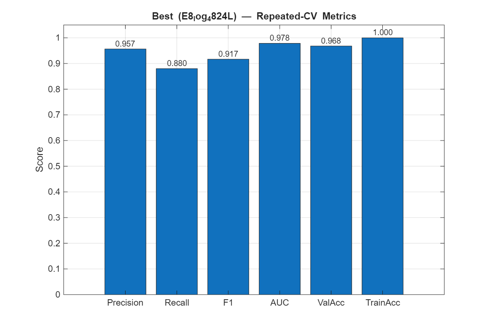
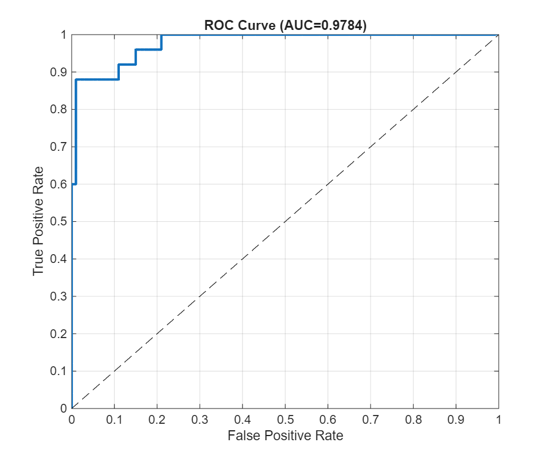
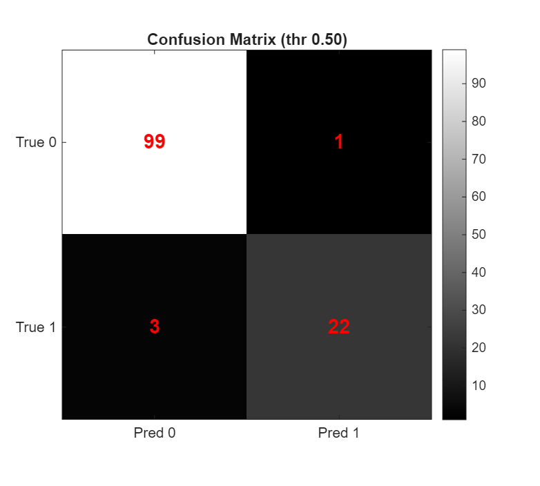

# Image Forgery Detection (Copy-Move) — MATLAB

Copy-move image forgery detection using **SIFT/MIFT features + SLIC superpixels +
color region growing**, with an **optimized deep-learning classifier** for the
performance metrics (precision, recall, F1, ROC-AUC, accuracy).

This repository contains the working code for the paper's forgery-detection
pipeline, refactored to run on a standard MATLAB install **without the Statistics
& Machine Learning Toolbox**.

## Requirements

- MATLAB R2025b (or recent)
- **Deep Learning Toolbox**
- **Image Processing Toolbox**
- (Optional) Parallel Computing Toolbox — speeds up the model sweep ~6×
- **No Statistics & ML Toolbox required** — `knnsearch`/`kmeans`/`fitcsvm` were
  replaced with base-MATLAB equivalents.

## Quick start

```matlab
% 1) Detect forgery in an image + report metrics (interactive: pick an image)
Forgery_Detection_GPU_Optimized

% 2) (Re)train the optimized deep-learning model and save it
train_final_model            % -> forgery_dl_model.mat

% 3) Classify feature rows with the trained model
[label, pForged] = dl_forgery_predict(featureRows);

% 4) Reproduce the full model search (parallel)
optimize_dl2                 % -> metrics_summary.csv + figures
```

## Best result

The winning configuration (`E8_log_4824L`: log-transformed features → dense
network `[48 24]`, dropout 0.35, weight-decay 5e-4, class-weighted loss, 800
epochs, 7-net ensemble), evaluated with repeated stratified 5-fold cross-validation:

| Metric | Value |
|---|---|
| Precision | 95.65% |
| Recall | 88.00% |
| F1 Score | 91.67% |
| ROC-AUC | 0.9784 |
| Validation / Overall Accuracy | 96.80% |

Confusion matrix: TP 22 · FP 1 · TN 99 · FN 3 (4 of 125 misclassified).





## Key files

| File | Purpose |
|---|---|
| `Forgery_Detection_GPU_Optimized.m` | Main pipeline: detection + deep-learning metrics |
| `optimize_dl2.m` | Parallel model-architecture sweep (repeated CV) |
| `train_final_model.m` | Trains the winning model → `forgery_dl_model.mat` |
| `dl_forgery_predict.m` | Reusable predictor (features → label, P(forged)) |
| `knnsearch_base.m`, `kmeans_base.m` | Base-MATLAB replacements (no Stats Toolbox) |
| `mift_sift.m`, `slic_full.m`, `color_grow.m`, `drawregionboundaries.m`, … | SIFT/segmentation support |
| `Accuracy_Data.mat` | Feature database (125×13) used for metric evaluation |
| `forgery_dl_model.mat` | Trained deep-learning ensemble + preprocessing |

## Notes

- Large datasets and paper-figure image folders (`ORIGINAL IMAGE RESULTS/`,
  `Paper1_Springer_MTAP/`, `frgd/`) and the `matlab_1.mat` / `matlab_2.mat`
  workspace dumps are **excluded** (see `.gitignore`) — they exceed GitHub's file
  limits and are not needed to run the code.
- The main script uses `uigetfile` (choose an image) and `msgbox` (verdict popup);
  run it from the MATLAB desktop.
